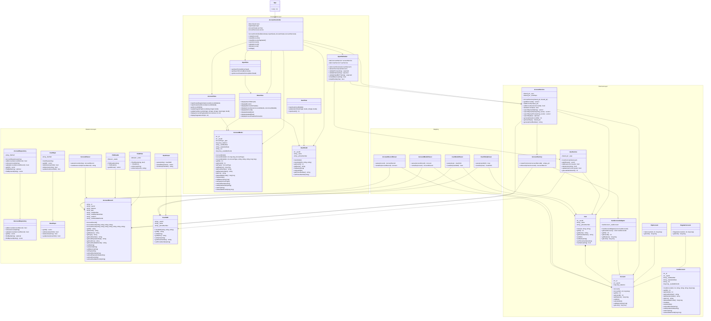

```mermaid
classDiagram
	namespace DataAccessLayer {
		class IAccountRepository {
            + addAccount(AccountRecord) bool
            + removeAccount(string)
            + updateAccount(AccountRecord) bool
            + getAll() vector<AccountRecord>
            + findById(string) optional<AccountRecord>
            + findByUserId(string) vector<AccountRecord>
	    }
		class AccountRepository {
            - string _filePath
            + AccountRepository(string)
            + addAccount(AccountRecord) bool
            + removeAccount(string)
            + updateAccount(AccountRecord) bool
            + getAll() vector<AccountRecord>
            + findById(string) optional<AccountRecord>
            + findByUserId(string) vector<AccountRecord>
	    }
		class IUserRepo {
            + getAll() vector<UserDAO>
            + addUser(UserDAO) bool
            + deleteUser(string) bool
            + updateUser(UserDAO) bool
	    }
		class UserRepo {
            - string _filePath
            + UserRepo(string)
            + getAll() vector<UserDAO>
            + addUser(UserDAO) bool
            + deleteUser(string) bool
            + updateUser(UserDAO) bool
	    }
		class AccountRecord {
            - string _id
            - string _userId
            - string _balance
            - string _type
            - string _cardNumber
            - string _cardExpirationDate
            - string _cardCvv
            - string _cardAvailableFunds
            + AccountRecord()
            + AccountRecord(string, string, string, string)
            + AccountRecord(string, string, string, string, string, string, string)
            + getID() string
            + getUserId() string
            + getBalance() string
            + getType() string
            + getCardNumber() string
            + getCardExpirationDate() string
            + getCardCvv() string
            + getCardAvailableFunds() string
            + setID(string)
            + setUserId(string)
            + setBalance(string)
            + setType(string)
            + setCardNumber(string)
            + setCardExpirationDate(string)
            + setCardCvv(string)
            + setCardAvailableFunds(string)
	    }
		class UserDAO {
            - string _userId
            - string _name
            - string _phoneNumber
            + UserDAO(string, string, string)
            + getId() string
            + setId(string)
            + getName() string
            + setName(string)
            + getPhoneNumber() string
            + setPhoneNumber(string)
	    }
		class FileWriter {
		- ofstream _writer
		+ FileWriter(string, bool)
		+ ~FileWriter()
		+ writeLine(string)
		+ writeLines(vector<string>, string)
	    }
		class FileReader {
            - ifstream _reader
            + FileReader(string)
            + ~FileReader()
            + getAllLines() vector<string>
	    }   
		class AccountParser {
            + parseAccount(string) AccountRecord
            + serializeAccount(AccountRecord) string
	    }
		class UserParser {
            + parse(string) UserDAO
            + parseMany(vector<string>) vector<UserDAO>
            + serialize(UserDAO) string
	    }
    }
	namespace BusinessLayer {
        class AccountService {
            - shared_ptr<IAccountRepository> _repo
            - shared_ptr<IUserRepo> _userRepo
            + AccountService(shared_ptr<IAccountRepository>, shared_ptr<IUserRepo>)
            + getAllAccounts() vector<unique_ptr<Account>>
            + addAccount(unique_ptr<Account>)
            + editAccount(const Account&) bool
            + deleteAccount(int) bool
            + searchByUserId(string) vector<unique_ptr<Account>>
            + searchByUserName(string, vector<User>) vector<unique_ptr<Account>>
            + searchByUserPhone(string, vector<User>) vector<unique_ptr<Account>>
            + searchById(int) optional<unique_ptr<Account>>
            + generateNewAccountID() int
            + getUserRepo() shared_ptr<IUserRepo>
            + generateCardNumber() string
        }
        class CardAccountAdapter {
            - CardAccount _cardAccount
            + CardAccountAdapter(const CardAccount&)
            + getCardAccount() const CardAccount&
            + getID() int
            + getUserId() int
            + getBalance() long long
            + getLimit() long long
        }
        class UserService {
            - shared_ptr<IUserRepo> _repo
            + UserService(shared_ptr<IUserRepo>)
            + getAllUsers() vector<User>
            + addUser(const User&) bool
            + deleteUser(string) bool
            + updateUser(const User&) bool
            + generateNewUserId() int
        }
        class AccountFactory {
            + createFrom(const AccountRecord&) unique_ptr<Account>
            + toRecord(const Account&) AccountRecord
        }
        class Account {
            - int _id
            - int _userId
            - long long _balance
            + Account()
            + Account(int, int, long long)
            + getID() int
            + getUserId() int
            + getBalance() long long
            + setID(int)
            + setUserId(int)
            + setBalance(long long)
            + getLimit() long long
        }
        class RegularAccount {
            + RegularAccount(int, int, long long)
            + getLimit() long long
        }
        class VipAccount {
            + VipAccount(int, int, long long)
            + getLimit() long long
        }
        class CardAccount {
            - int _id
            - int _userId
            - string _cardNumber
            - string _expirationDate
            - string _cvv
            - long long _availableFunds
            + CardAccount(int, int, string, string, string, long long)
            + getID() int
            + getUserId() int
            + getCardNumber() string
            + getExpirationDate() string
            + getCvv() string
            + getAvailableFunds() long long
            + setID(int)
            + setUserId(int)
            + setCardNumber(string)
            + setExpirationDate(string)
            + setCvv(string)
            + setAvailableFunds(long long)
        }
        class User {
            - int _userId
            - string _name
            - string _phoneNumber
            + User(int, string, string)
            + getId() int
            + getName() string
            + getPhoneNumber() string
            + setId(int)
            + setName(string)
            + setPhoneNumber(string)
            + hasName(string) bool
        }
    }
    namespace PresentationLayer {
        class AccountController {
            - MenuView& menu
            - InputView& input
            - AccountView& accView
            - AccountService& service
            + AccountController(MenuView&, InputView&, AccountView&, AccountService&)
            + createAccount()
            + viewAllAccounts()
            + viewAllAccountsPaginated()
            + searchAccount()
            + updateAccount()
            + deleteAccount()
            + exitApp()
        }
        class AccountModel {
            - int _id
            - int _userId
            - AccountType _type
            - long long _balance
            - string _cardNumber
            - string _expirationDate
            - string _cvv
            - long long _availableFunds
            + AccountModel()
            + AccountModel(int, int, long long, AccountType)
            + AccountModel(int, int, AccountType, string, string, string, long long)
            + getID() int
            + getUserId() int
            + getType() AccountType
            + getBalance() long long
            + getCardNumber() string
            + getExpirationDate() string
            + getCvv() string
            + getAvailableFunds() long long
            + setUserId(int)
            + setBalance(long long)
            + setType(AccountType)
            + setCardNumber(string)
            + setExpirationDate(string)
            + setCvv(string)
            + setAvailableFunds(long long)
        }
        class UserModel {
            - int _userId
            - string _name
            - string _phoneNumber
            + UserModel()
            + UserModel(int, string, string)
            + getUserId() int
            + getName() string
            + setName(string)
            + setUserId(int)
            + getPhoneNumber() string
            + setPhoneNumber(string)
        }
        class InputValidation {
            - static AccountService* accountService
            - static UserService* userService
            + setAccountService(AccountService*)
            + setUserService(UserService*)
            + validatePhone(string) expected<void, string>
            + validateName(string) expected<void, string>
            + validateDateMMYY(string) expected<void, string>
            + isValidBalance(string) bool
            + isValidYesNo(char) bool
        }

            class UserView {
            + inputUser(UserModel&)
            + updateUserInfo(string&, bool&, string&, bool&)
            + inputUserId() int
        }
        class MenuView {
            + displaySearchMenu(int)
            + displayMenu(int)
            + displayAllAccountsHeader()
            + displayAccount(const AccountModel&, const UserModel&)
            + displayNotFound()
            + displayDeleted(bool)
            + displayUpdated(float)
            + displayAccountCreationChoice(int)
        }
        class InputView {
            + getUserChoice(MenuView&)
            + getSearchChoice(MenuView&)
            + getAccountCreationChoice(MenuView&)
        }
        class AccountView {
            + inputCreateRegularVipAccount(AccountModel&)
            + inputCreateCardAccount(AccountModel&)
            + getAccountId(int&)
            + updateRegularVipAccount(long long&, bool&)
            + updateCardAccount(string&, string&, string&, long long&, bool&)
            + displayAccountsPaginated(const vector<AccountModel>&, int, int)
            + displayPaginationInfo(int, int)
        }
    }
    class App {
		+ run() int
	}
    
    namespace Mapping {
        class AccountModelParser {
            + parse(AccountRecord) Account
            + serialize(Account) AccountRecord
        }
        class AccountRecordParser {
            + parse(Account) AccountRecord
            + serialize(AccountRecord) Account
        }
        class UserEntityParser {
            + parse(UserDAO) User
            + serialize(User) UserDAO
        }
        class UserModelParser {
            + parse(User) UserDAO
            + serialize(UserDAO) User
        }
    }
    RegularAccount --|> Account
    VipAccount --|> Account
    AccountService --> Account
    AccountService --> User
    AccountService --> AccountFactory
    CardAccountAdapter --|> Account
    AccountFactory --> CardAccountAdapter
    UserService --> User
    AccountService --> AccountRecord
    AccountFactory --> AccountRecord
    UserService --> UserDAO
    FileWriter --> AccountRecord
    FileReader --> AccountRecord
    AccountParser --> AccountRecord
    UserParser --> UserDAO
    AccountRepository --|> IAccountRepository
    UserRepo --|> IUserRepo
    %% Composition: User owns Account
    User *-- Account
    
    %% PresentationLayer relationships
    AccountController --> MenuView
    AccountController --> InputView
    AccountController --> AccountView
    AccountController --> AccountService
    AccountController --> AccountModel
    AccountController --> UserModel
    AccountController --> InputValidation
    AccountView --> AccountModel
    UserView --> UserModel
    MenuView --> AccountModel
    MenuView --> UserModel
    InputView --> MenuView
    InputValidation --> AccountService
    InputValidation --> UserService

    %% Mapping relationships
    AccountModelParser --> AccountRecord
    AccountModelParser --> Account
    AccountRecordParser --> Account
    AccountRecordParser --> AccountRecord
    UserEntityParser --> UserDAO
    UserEntityParser --> User
    UserModelParser --> User
    UserModelParser --> UserDAO

    %% App relationships
    App --> AccountController
```
